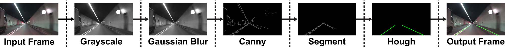

# version-1
## Basic Lane Detection - Filter Pipeline
----
Die ist die erste Version der Fahrspurerkennung

- 1. Einzelnes Frame wird entnommen und der "Pipline" zugeführt
- 2. Umwandeln vom Farbbild in Graustufen Bild (Grayscale)
- 3. Anwenden eines leichten Weichzeichners ( Gaussian Blur)
- 4. Anwenden des Canny detectors 
- 5. Segmentieren: RIO (Region of Interest definieren)
- 6. Finden der Linien durch Hough Transformation
- 7. Erstellen des Ausgangs Bild: Hough Linien + Eingangsbild

### Requirements 
- numpy
- matplotlib
- opencv
- python3 

