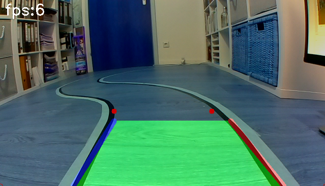
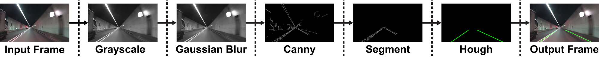

### version-1: Softwaremodul zur Fahrspurerkennung in Videoechtzeit für autonome Modellfahrzeuge
* * * *
##### Fahrspurerkennung durch eine Filterpipeline

Die ist die erste Version der Fahrspurerkennung

1. Einzelnes Frame wird entnommen und der "Pipline" zugeführt
2. Umwandeln vom Farbbild in Graustufen Bild (Grayscale)
3. Anwenden eines leichten Weichzeichners (Gaussian Blur)
4. Anwenden des Canny detectors 
5. Segmentieren: RIO (Region of Interest) definieren
6. Finden der Linien durch Hough Transformation
7. Erstellen des Ausgangs Bild: Hough Linien + Eingangsbild

## Fazit
Diese Methode im ersten Ansatz scheint anständig zu funktionieren. Zumindest für klare gerade Straßen. Bei Kurven allerdings funktioniert diese Methode nicht, weil zum erkennen der Fahrbahnmarkierung die Hough Transformation benutz wurde und hier nur Geraden erfasst werden. Ein weiterer Nachteil ist, dass Fahrspuren mit gestrichelten Markierungen oder Fahrspuren ohne klare Markierungen (z.B. alte Markierungen) ebenfalls vom Fahrspurdetektor ignoriert werden, da es keine durchgehenden Geraden gibt, die den Schwellenwert der Hough-Transformation erfüllen. Zudem wurde festgestellt, dass das Vorhandensein von Markierungen wie z.B. bemalte Pfeilschilder den Fahrspurdetektor große Probleme bereiten. Eine Möglichkeit, dies zu umgehen, wäre das separieren der einzelnen Fahrbahnmarkierung und das erweitern der Region of interest um z.B. einen weiteren Dreieck zwischen den Spuren. Schließlich können auch Wetter- und Lichtverhältnisse, die die Sichtbarkeit der Fahrspuren beeinträchtigen und ein weiteres Problem darstellen. 

### Requirements 
- numpy
- matplotlib
- opencv
- python3 

